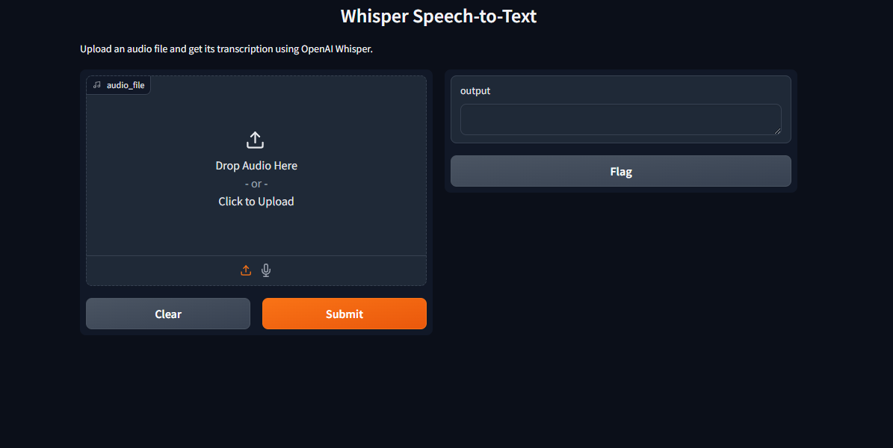

# Whisper Speech-to-Text GUI (Dockerized Gradio)



## 📌 Overview

This repository provides a **Dockerized Gradio-based GUI** for OpenAI Whisper, enabling easy **speech-to-text transcription**. The setup includes:

- **Whisper Model** (Small, Base, or Customizable)
- **Gradio UI** for audio file uploads and transcription
- **Docker support** for portability and ease of deployment

## 🚀 Installation & Setup (Fresh Machine)

### **1️⃣ Prerequisites**

Ensure your system meets the following requirements:

- **Docker & Docker Compose** installed:
  - **Windows/macOS:** [Download Docker Desktop](https://www.docker.com/products/docker-desktop/)
  - **Linux:** Install using:
    ```bash
    sudo apt update && sudo apt install -y docker.io docker-compose
    ```
- **GPU (Optional):** If using an NVIDIA GPU for acceleration, install:
  ```bash
  sudo apt install -y nvidia-container-toolkit
  sudo systemctl restart docker
  ```

---

### **2️⃣ Clone the Repository**

```bash
git clone https://github.com/syntaxRead3r/whisper-gui-docker.git
cd whisper-gui-docker
```

---

### **3️⃣ Build & Run the Container**

Run the following command to **build and launch** the application:

```bash
docker compose up --build -d
```

This will:
✅ **Pull dependencies** (Whisper, Gradio, PyTorch, etc.)
✅ **Build the Docker image**
✅ **Launch the Whisper GUI on port `7000`**

**Access the UI:**

```
http://localhost:7000
```

---

### **4️⃣ Updating & Rebuilding**

To update and rebuild after making changes:

```bash
docker compose up --build -d
```

To **stop and remove containers**:

```bash
docker compose down
```

To **fully remove all containers and volumes** (clean install):

```bash
docker compose down --volumes
```

---

## 🛠️ Configuration Options

### **Change the Whisper Model**

Modify `app.py`:

```python
model = whisper.load_model("base")  # Change to "tiny", "small", "medium", or "large"
```

Then **restart the container**:

```bash
docker compose up --build -d
```

### **Change the Port**

Modify **`app.py`**:

```python
iface.launch(server_name="0.0.0.0", server_port=7020)
```

Modify **`docker-compose.yml`**:

```yaml
ports:
  - "7000:7020"
```

Rebuild:

```bash
docker compose up --build -d
```

---

## 📜 License

This project is licensed under the **MIT License**.

---

## 📞 Support & Contributions

For issues, open a ticket on GitHub.
To contribute, fork the repo and submit a pull request.

Developed by **syntaxRead3r**.

